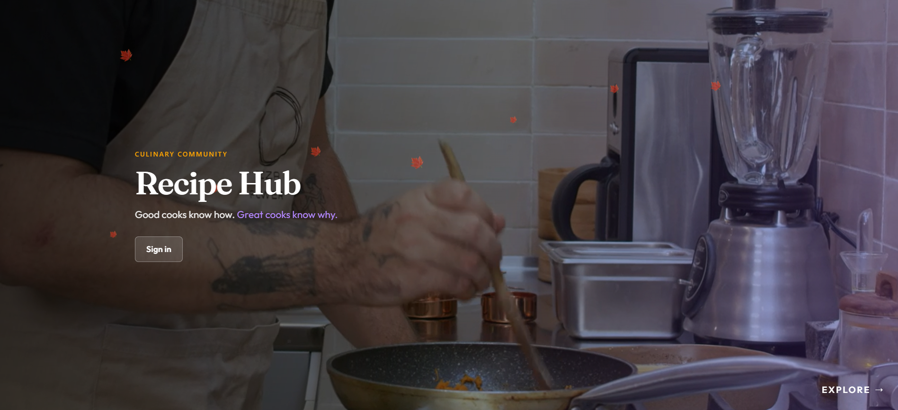

# Recipe Hub

Full-stack, role-based recipe discovery and publishing platform.

<p align="center">
  
</p>

<p align="center">
  <a href="https://anish-recipehub.netlify.app"><strong>Live demo</strong></a>
</p>

Recipe Hub lets three kinds of users — general users, chefs, and admins — interact with a shared recipe catalog differently: general users discover and save recipes, chefs publish and manage their own, and the platform layers in live culinary news alongside seasonal UI theming. The API is documented with Swagger rather than left for the frontend to reverse-engineer, and auth is JWT-based with bcrypt-hashed credentials rather than rolled by hand.

**Stack:** React 18 · Node.js / Express · MongoDB Atlas (Mongoose) · JWT auth

**Author:** Anish Kuila

**Status:** Feature-complete, deployed live

## Table of contents
- [What it does](#what-it-does)
- [Architecture](#architecture)
- [Scale](#scale)
- [Install](#install)
- [Quickstart](#quickstart)
- [Project structure](#project-structure)
- [API reference](#api-reference)
- [Limitations](#limitations)

## What it does

```
Client (React) ──▶ [Express API] ──▶ [MongoDB]
                        │
        ┌───────────────┼───────────────┬───────────────┐
        ▼               ▼               ▼               ▼
    User/Auth        Recipe CRUD     News Feed        Email
  (JWT, bcrypt)   (tags, ratings,   (culinary          (Nodemailer)
                   ingredient        updates)
                   search)
```

Recipes can be queried by tag, by ingredient list, or by minimum rating — not just fetched wholesale and filtered client-side. Ratings are stored per-recipe and aggregated server-side. Saved recipes are tracked per-user for a personal collection view.

## Architecture

| Layer | Technology |
|---|---|
| Frontend | React 18, Redux, Chakra UI, MUI, Bootstrap, Framer Motion |
| Backend | Express 4, Mongoose (MongoDB ODM) |
| Auth | JWT (jsonwebtoken) + bcrypt password hashing |
| Validation | express-validator |
| Docs | swagger-jsdoc + swagger-ui-express |
| Email | Nodemailer |
| Hosting | Netlify (frontend) · Render (backend) · MongoDB Atlas (database) |

## Scale

Counted directly from the route files:

| Metric | Count |
|---|---|
| REST API endpoints | 24, across 4 route modules (user, recipe, news, email) |
| User roles | 3 (Admin, Chef, General User) |
| Data models | 3 (User, Recipe, HubNews) |

## Install

Requires Node 18+ and a MongoDB instance (local, or a MongoDB Atlas cluster for production-parity).

```bash
git clone https://github.com/anishneu/RecipeHub.git
cd RecipeHub

# Backend
cd backend
npm install
cp .env.example .env   # MONGO_URI, JWT_SECRET, SMTP creds

# Frontend
cd ../frontend
npm install
cp .env.example .env   # REACT_APP_API_URL (defaults to http://localhost:5000)
```

## Quickstart

```bash
# Backend
cd backend && npm start        # runs on the port set in .env

# Frontend
cd frontend && npm start       # CRA dev server on :3000
```

Or skip local setup entirely and try the live deployment: **[anish-recipehub.netlify.app](https://anish-recipehub.netlify.app)**

API docs (Swagger UI) are served once the backend is running — see `backend/src/routes` for the mount path.

## Project structure

```
RecipeHub/
├── backend/
│   └── src/
│       ├── models/       User.js, Recipe.js, HubNews.js
│       ├── routes/       userRoutes, recipeRoutes, newsRoutes, emailRoutes
│       └── services/      Business logic
└── frontend/
    └── src/
        ├── Component/     UI components (incl. Footer, social links)
        ├── Redux/          Store, actions, reducers
        ├── actions/        Redux action creators
        └── api.js           Centralized API base URL (env-driven, backend-agnostic)
```

## API reference

| Route group | Endpoints | Purpose |
|---|---|---|
| `/user` | 10 | Register, login, edit, get chefs/users, saved-recipe management |
| `/recipe` | 11 | CRUD, search by tag/ingredients/rating, ratings |
| `/news` | 2 | Create/fetch culinary news items |
| `/email` | 1 | Contact/notification email send |

## Limitations

- No automated test suite.
- No CI/CD pipeline configured.
